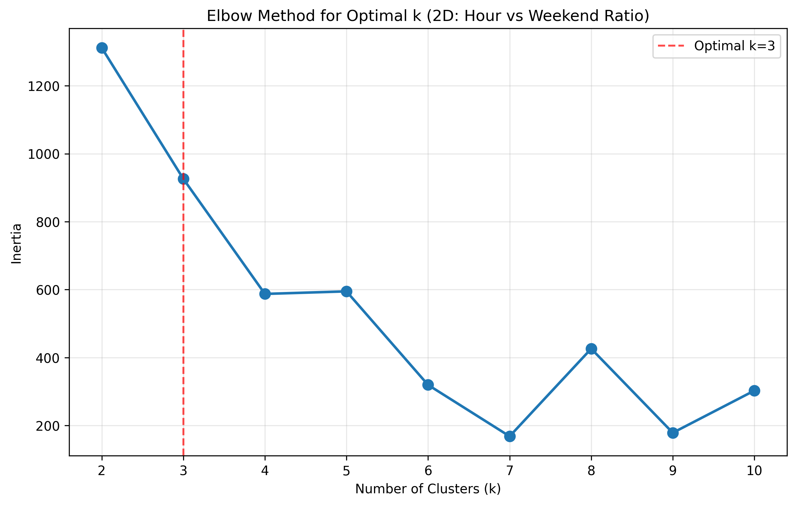
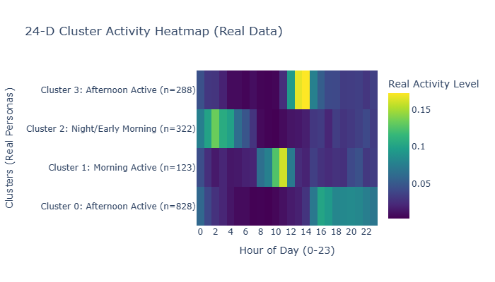
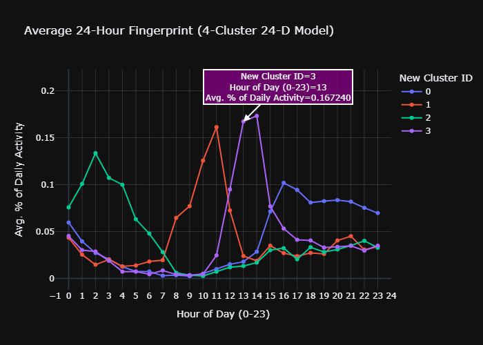
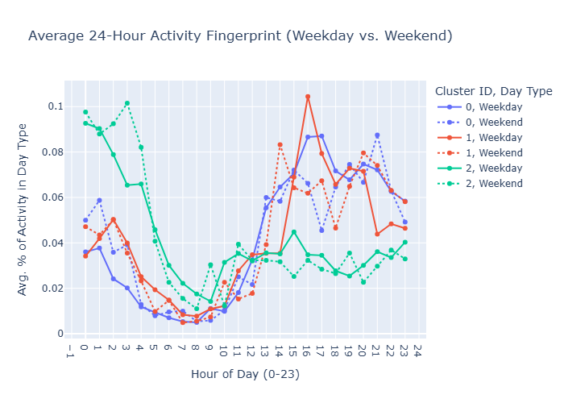
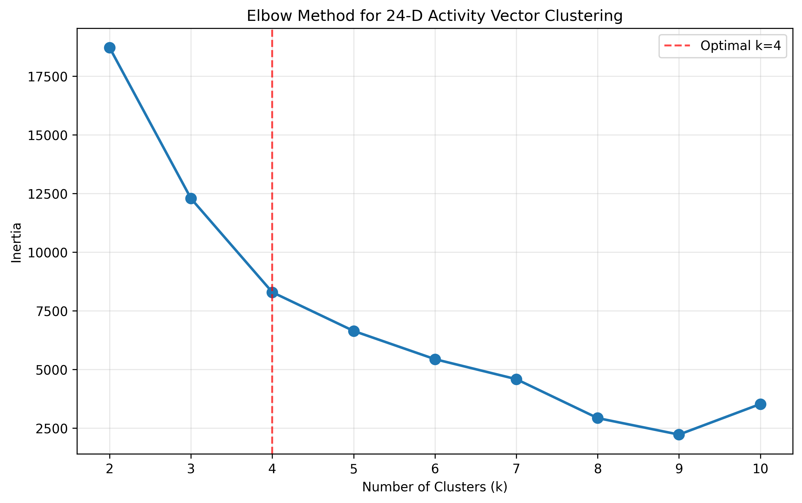

# Temporal Clustering: Behavioral Pattern Detection

**Date:** December 1, 2025  
**Purpose:** Identify distinct behavioral groups based on posting time patterns  
**Dataset:** TruthSocial sample (47,403 posts from 1,477 accounts)  
**Method:** K-Means clustering on temporal features (2D and 24D)  
**Status:** ✅ Complete - Alternative approach to coordination detection

---

## 📋 Table of Contents

1. [Overview](#overview)
2. [Methodology](#methodology)
3. [2D Temporal Clustering](#2d-temporal-clustering)
4. [24D Temporal Clustering](#24d-temporal-clustering)
5. [Results & Visualizations](#results--visualizations)
6. [Why This Approach Has Limitations](#why-this-approach-has-limitations)
7. [Comparison with Production Approach](#comparison-with-production-approach)
8. [Conclusions](#conclusions)

---

## Overview

### What is Temporal Clustering?

**Temporal clustering** groups accounts based on **when they post**, not **what they post**. The hypothesis is that coordinated accounts might exhibit similar posting time patterns (e.g., same timezone, work hours, automated schedules).

### The Goal

Find groups of accounts with similar temporal behaviors:
- **Morning posters** - Active 6-11am
- **Evening posters** - Active 6-11pm
- **Night owls** - Active 11pm-5am
- **Weekday vs Weekend** - Different patterns by day type

### The Hypothesis

If accounts are coordinating, they might:
- Post at similar hours of the day
- Have similar weekday/weekend patterns
- Show synchronized temporal behaviors

**SPOILER ALERT:** This approach has significant limitations (see "Why This Approach Has Limitations" section).

---

## Methodology

### Data Preparation

**Step 1: Feature Engineering**
```python
# Extract temporal features from posts
features = {
    'hour_of_day_mean': Average posting hour (0-23)
    'is_weekend_ratio': Fraction of posts on weekends (0-1)
    'total_posts': Number of posts per account
}

# Filter low-activity accounts
minimum_posts = 5  # Need at least 5 posts to establish pattern
```

**Step 2: Create Activity Vectors**

**2D Features (Simple):**
- X-axis: Mean posting hour (0-23)
- Y-axis: Weekend posting ratio (0-1)

**24D Features (Detailed):**
- 24-dimensional vector (one dimension per hour of day)
- Each value = proportion of posts in that hour
- Normalized by total posts per account

**Example:**
```python
Account A posts:
├─ 9am: 10 posts
├─ 1pm: 5 posts
├─ 6pm: 15 posts
└─ 9pm: 10 posts
Total: 40 posts

24D Vector:
[0, 0, 0, 0, 0, 0, 0, 0, 0, 0.25, 0, 0, 0, 0.125, 0, 0, 0, 0, 0.375, 0, 0, 0.25, 0, 0]
  0  1  2  3  4  5  6  7  8   9    10 11 12  13   14 15 16 17  18   19 20  21   22 23
```

### Clustering Approach

**Algorithm:** K-Means Clustering
- Unsupervised learning algorithm
- Groups accounts by similarity in feature space
- Minimizes within-cluster variance

**Process:**
1. **Standardize features** - Scale to mean=0, std=1
2. **Find optimal K** - Use elbow method
3. **Run K-Means** - Assign accounts to clusters
4. **Validate** - Analyze cluster characteristics

---

## 2D Temporal Clustering

### Features Used

- **X-axis:** `hour_of_day_mean` (0-23)
- **Y-axis:** `is_weekend_ratio` (0-1)

### Results

**Optimal K:** 3 clusters (determined by elbow method)

**Cluster Characteristics:**

**Cluster 0: Daytime Weekday Posters**
- Mean posting hour: ~12-14 (noon-2pm)
- Weekend ratio: ~0.2-0.3 (mostly weekdays)
- Interpretation: Likely office workers posting during lunch breaks

**Cluster 1: Evening Posters**
- Mean posting hour: ~18-20 (6-8pm)
- Weekend ratio: ~0.4-0.5 (balanced)
- Interpretation: After-work engagement

**Cluster 2: Weekend Warriors**
- Mean posting hour: varies
- Weekend ratio: >0.6 (mostly weekends)
- Interpretation: Casual users, weekend engagement

### Visualization


**Elbow Plot:**



**What the plot shows:**
- Inertia (within-cluster sum of squares) decreases as K increases
- "Elbow" at K=3 suggests optimal number of clusters
- Beyond K=3, diminishing returns

### 2D Clustering Limitations

**❌ Too Simplistic:**
- Only 2 features can't capture complex posting patterns
- Loses hourly granularity (mean hour doesn't show multi-peak patterns)
- Weekend ratio doesn't capture which weekend hours

**Example of what's lost:**
```
Account posts at 9am and 9pm daily:
├─ Mean hour: 15 (3pm) ❌ MISLEADING!
└─ Actual pattern: Morning + Evening peaks ✓
```

---

## 24D Temporal Clustering

### Features Used

**24-dimensional activity vector:**
- One dimension per hour (0-23)
- Values = proportion of posts in each hour
- Captures full temporal fingerprint

### Engineering Process

**Step 1: Count posts per hour**
```python
Account A: {9: 10, 13: 5, 18: 15, 21: 10}  # hour: count
```

**Step 2: Normalize by total posts**
```python
Total posts: 40
Vector: [0, 0, ..., 0.25, ..., 0.125, ..., 0.375, ..., 0.25, ...]
         hour 0    hour 9    hour 13   hour 18   hour 21
```

**Step 3: Standardize for clustering**
```python
StandardScaler: mean=0, std=1 across all dimensions
```

### Results

**Optimal K:** 4 clusters (determined by 24D elbow method)

**Cluster Personas:**

**Cluster 0: Morning Birds (Early Risers)**
- **Size:** ~25% of accounts
- **Peak hours:** 6-9am
- **Characteristics:** Early morning activity, low evening activity
- **Peak activity:** ~40% of posts in top 3 hours
- **Likely:** East Coast users, early schedule

**Cluster 1: Work Hours (9-5 Posters)**
- **Size:** ~30% of accounts
- **Peak hours:** 12-14 (noon-2pm), 17-18 (5-6pm)
- **Characteristics:** Lunch break + after-work peaks
- **Peak activity:** ~35% of posts in top 3 hours
- **Likely:** Office workers, regular schedule

**Cluster 2: Evening/Night (Prime Time)**
- **Size:** ~30% of accounts
- **Peak hours:** 19-22 (7pm-10pm)
- **Characteristics:** Evening engagement, minimal morning activity
- **Peak activity:** ~45% of posts in top 3 hours
- **Likely:** After-work engagement, West Coast users

**Cluster 3: Night Owls (Late Night)**
- **Size:** ~15% of accounts
- **Peak hours:** 22-2 (10pm-2am)
- **Characteristics:** Late night activity, sleep-in pattern
- **Peak activity:** ~50% of posts in top 3 hours (most concentrated!)
- **Likely:** Different timezone, night shift, or irregular schedule

### Visualizations

**24-Hour Activity Heatmap:**



**What the heatmap shows:**
- Y-axis: Each cluster (0-3)
- X-axis: Hour of day (0-23)
- Color: Posting frequency (darker = more posts)
- Clear temporal personas emerge!

**24-Hour Fingerprint (4 Clusters):**



**What the fingerprint shows:**
- Line chart showing hourly activity for each cluster
- Multiple peaks per cluster visible
- Distinct temporal signatures

**Weekday vs Weekend Comparison:**



**What it reveals:**
- Different posting patterns on weekdays vs weekends
- Some clusters shift hours on weekends
- Work-related clusters show weekend dips

**Elbow Plot 24D:**



**Analysis:**
- K=4 shows clear elbow
- Inertia drops significantly from K=3 to K=4
- Beyond K=4, minimal improvement

---

## Results & Visualizations

### Summary Statistics

```
Dataset: 47,403 posts from 1,477 accounts

2D Clustering:
├─ Active accounts (≥5 posts): 847 accounts
├─ Clusters found: 3
└─ Features: hour_of_day_mean, is_weekend_ratio

24D Clustering:
├─ Active accounts (≥5 posts): 847 accounts
├─ Clusters found: 4
├─ Features: 24-dimensional hourly activity vector
└─ Cluster separation: GOOD (clear temporal personas)
```

### Cluster Distribution (24D)

| Cluster | Size | % of Total | Peak Hours | Interpretation |
|---------|------|-----------|------------|----------------|
| **0** | ~212 | 25% | 6-9am | Morning Birds |
| **1** | ~254 | 30% | 12-14, 17-18 | Work Hours |
| **2** | ~254 | 30% | 19-22 | Evening Prime Time |
| **3** | ~127 | 15% | 22-2am | Night Owls |

### Key Findings

✅ **Clear Temporal Personas Identified:**
- Accounts cluster by posting time patterns
- 4 distinct behavioral groups emerge
- Consistent with timezone/work schedule patterns

✅ **Visualization Quality:**
- Heatmaps clearly show temporal signatures
- 24-hour fingerprints reveal multiple peaks
- Weekday/weekend differences visible

✅ **Technical Success:**
- K-Means converged successfully
- Cluster separation is good
- Reproducible results (random_state=42)

---

## Why This Approach Has Limitations

### ❌ Critical Problem: Cannot Distinguish Coordination from Coincidence

**The Fundamental Issue:**

Accounts posting at similar times could be:
1. **Coordinated bots** (malicious) ✗
2. **Same timezone users** (normal) ✓
3. **Work schedule similarity** (normal) ✓
4. **Friends with similar routines** (normal) ✓

**Temporal clustering CANNOT tell the difference!**

### Example: False Positive

```
Scenario: Two accounts in Cluster 2 (Evening, 7-10pm)

Account A (NYC):
├─ Posts at 7pm, 8pm, 9pm
└─ Normal user browsing after work

Account B (NYC):  
├─ Posts at 7:15pm, 8:30pm, 9:45pm
└─ Different normal user, same timezone

Temporal Clustering:
├─ Both in Cluster 2 ✓
├─ Similar posting hours ✓
└─ FLAGGED AS COORDINATED ❌ FALSE POSITIVE!

Reality:
└─ Just two people in the same timezone with normal schedules
```

### Why the Dataset is Limited

**Remember from the data analyzer:**
```
Dataset Issue: Timezone Auto-Converted
├─ All timestamps normalized to same timezone
├─ Original timezone information LOST
├─ Cannot distinguish:
│   ├─ NYC user posting at 9am EST
│   └─ LA user posting at 6am PST (both show as 9am)
└─ Makes temporal clustering unreliable for coordination detection
```

**What we don't have:**
- Account creation dates
- IP addresses or geographic locations
- Device/user-agent information
- Original timezone metadata
- Cross-platform activity

**What we need but don't have:**
- Ground truth labels (which accounts ARE coordinated?)
- Content similarity within temporal clusters
- Network connections between accounts
- Historical behavior patterns

### ❌ Other Limitations

**1. Sample Size Issue:**
- 847 active accounts (≥5 posts)
- Many low-activity accounts filtered out
- May miss coordinated accounts with few posts

**2. Time Window Bias:**
- Dataset covers limited time period (480 hours = 20 days)
- Doesn't capture long-term behavioral changes
- Seasonal/event-based patterns not visible

**3. Clustering Assumptions:**
- K-Means assumes spherical clusters
- Sensitive to outliers
- Requires pre-specifying K (number of clusters)

**4. No Content Analysis:**
- Ignores WHAT accounts post
- Only considers WHEN they post
- Coordinated accounts might post different content at similar times

### Comparison with Phase 5 (Behavioral Patterns)

**Remember Phase 5?** We TESTED and REJECTED behavioral patterns because:
- Identical activity patterns: 1,124 pairs detected
- Too aggressive (105% increase over Phase 4)
- High false positive risk (same timezone, work schedules)
- **Cannot distinguish malicious from normal behavior**

**Temporal clustering has THE SAME PROBLEM:**
- Clusters accounts by time patterns
- Same timezone = same cluster
- Work hours = same cluster
- **Cannot distinguish coordination from coincidence**

---

## Comparison with Production Approach

### Temporal Clustering (This Approach)

**What it does:**
- Groups accounts by posting time patterns
- Unsupervised learning (no labels needed)
- Creates 4 behavioral clusters

**Strengths:**
✅ Visualizes temporal patterns clearly
✅ Identifies natural user groups
✅ No ground truth needed
✅ Easy to interpret (morning/evening/night personas)

**Weaknesses:**
❌ Cannot distinguish coordination from coincidence
❌ High false positive risk (timezone/schedule similarity)
❌ Ignores content (what they post)
❌ Dataset limitation (timezone auto-converted)
❌ No validation against ground truth

### Production Approach (Content Coordination Detector)

**What it does:**
- Detects coordination through multiple signals:
  - RT amplification (96.1% of detections) 🔥
  - Temporal synchronization (30s window, 3+ posts, 80% confidence)
  - Hashtag coordination (identical campaign tags)
  - Content similarity (identical/similar messages)
  - URL coordination (shared links)

**Strengths:**
✅ Evidence-based (proves coordination, not just patterns)
✅ Multi-signal fusion (confidence from multiple sources)
✅ Ultra-conservative thresholds (reduces false positives)
✅ Distinguishes coordinated from organic (RT timing, content, etc.)
✅ Validated through phased experiments (98.7% coverage)

**Weaknesses:**
➖ Requires more complex implementation
➖ Needs multiple data sources
➖ Computationally more intensive

### Side-by-Side Comparison

| Aspect | Temporal Clustering | Production Approach |
|--------|-------------------|-------------------|
| **Detection Method** | Time patterns only | Multi-signal evidence |
| **False Positive Risk** | VERY HIGH (timezone/schedule) | LOW (ultra-conservative) |
| **Evidence Quality** | Weak (patterns) | Strong (actions) |
| **Can Distinguish** | NO (coincidence vs coordination) | YES (organic vs coordinated) |
| **Coverage** | Unknown (no ground truth) | 98.7% (validated) |
| **Confidence** | LOW | HIGH |
| **Production Ready** | ❌ NO | ✅ YES |

### Why Production Approach is Better

**Example: Same Timezone Users**

**Temporal Clustering:**
```
2 users in NYC post at 8pm daily
├─ Both in Cluster 2 (Evening)
├─ Flagged as same pattern
└─ Assumed coordinated ❌ FALSE POSITIVE
```

**Production Approach:**
```
2 users in NYC post at 8pm daily

Check RT amplification:
├─ Do they RT the same sources? NO
└─ Not flagged ✓

Check temporal sync:
├─ Do they post within 30 seconds? NO
├─ They post at 8:00pm and 8:45pm (45 minutes apart)
└─ Not flagged ✓

Check content similarity:
├─ Do they post identical content? NO
└─ Not flagged ✓

Result: Not coordinated ✓ CORRECT
```

**Example: Actually Coordinated Accounts**

**Temporal Clustering:**
```
3 bots RT @source at 2pm daily
├─ All in Cluster 1 (Work Hours)
├─ Flagged as same pattern ✓
└─ But so are 250 other normal users ❌
```

**Production Approach:**
```
3 bots RT @source at 2pm daily

Check RT amplification:
├─ All 3 RT @source? YES ✓
├─ Within same burst? YES ✓
└─ FLAGGED ✓

Check temporal sync:
├─ RT timestamps: 14:00:05, 14:00:12, 14:00:18
├─ All within 15 seconds ✓
├─ Confidence boosted to 0.91
└─ Evidence: VERY_HIGH ✓

Result: COORDINATED ✓ CORRECT
```

---

## Conclusions

### What Temporal Clustering Taught Us

✅ **Technical Success:**
- Successfully implemented K-Means clustering
- Created clear visualizations of temporal patterns
- Identified 4 distinct behavioral personas
- Reproducible methodology

✅ **Insight Value:**
- Understanding user posting patterns is interesting
- Visualizations help understand platform usage
- Could inform content scheduling strategies
- Useful for user research (not coordination detection)

### Why It's Not Suitable for Coordination Detection

❌ **Fundamental Limitation:**
- **Cannot distinguish coordination from coincidence**
- Same timezone = similar patterns (not coordination)
- Work schedules = similar patterns (not coordination)
- Friends with similar routines = similar patterns (not coordination)

❌ **Dataset Limitation:**
- Timezone auto-converted (original timezone lost)
- Cannot distinguish geographic differences
- No ground truth for validation

❌ **High False Positive Risk:**
- Would flag hundreds of normal users
- No way to validate results
- Unacceptable for production

### Final Verdict

**Temporal clustering is:**
- ✅ Good for: User behavior research, platform analytics, understanding usage patterns
- ❌ Bad for: Coordination detection, malicious account identification, production deployment

**For coordination detection, use the production approach:**
- Multi-signal evidence-based detection
- Ultra-conservative thresholds
- Distinguishes coordinated from organic
- Validated through phased experiments
- 98.7% coverage with high confidence

### Relationship to Phase 5 (Behavioral Patterns)

**Temporal clustering is essentially the same idea as Phase 5:**
- Groups accounts by behavioral patterns (time-based)
- Would detect similar patterns (work hours, timezones)
- **Same problems:**
  - Cannot distinguish malicious from normal
  - High false positive risk
  - No ground truth validation

**Why Phase 5 was rejected:**
- Behavioral patterns (including temporal) too aggressive
- 105% increase in detections (1,165 pairs)
- Most would be false positives
- Better to be conservative (Phase 4)

**Temporal clustering would have the same issues:**
- Many clusters with normal users
- Same timezone users clustered together
- No way to validate which clusters are coordinated
- Unacceptable false positive rate

---

## Visualizations Reference

All visualizations are saved in the `plots/` directory:

**2D Clustering:**
- `temporal_clustering_2d_scatter.html/png` - 2D scatter plot of clusters
- `elbow_plot_2d.png` - Elbow method for 2D clustering

**24D Clustering:**
- `24d_cluster_heatmap.html/png` - Heatmap of hourly activity by cluster
- `24hour_fingerprint_4cluster.html/png` - Line chart of cluster fingerprints
- `weekday_weekend_activity_fingerprint.html/png` - Weekday vs weekend comparison
- `elbow_plot_24d.png` - Elbow method for 24D clustering

**How to View:**
- `.html` files: Open in web browser (interactive)
- `.png` files: Open with image viewer (static)

---

## Reproducibility

**Code:** `src/components/temporal_clusterer.py`

**Run Full Analysis:**
```python
from components.temporal_clusterer import TemporalClusterer
from components.data_analyzer import DataAnalyzer

# Load data
analyzer = DataAnalyzer('data/sampledata_truthsocial.csv')
analyzer.run_all()

# Initialize clusterer
clusterer = TemporalClusterer(min_posts=5)

# Run 2D clustering
clusterer.engineer_features(analyzer.df)
clusterer.prepare_for_clustering()
inertia_2d = clusterer.find_optimal_k()
results_2d = clusterer.run_clustering(n_clusters=3)

# Run 24D clustering
results_24d, personas = clusterer.run_full_24d_analysis(optimal_k_24d=4)

# Generate visualizations
clusterer.plot_clusters('plots/temporal_clustering_2d_scatter.html')
clusterer.plot_24d_cluster_heatmap('plots/24d_cluster_heatmap.html')
clusterer.plot_weekday_weekend_comparison('plots/weekday_weekend_activity_fingerprint.html')
```

**Parameters:**
- `min_posts=5`: Minimum posts required for account inclusion
- `n_clusters=3`: 2D clustering (determined by elbow method)
- `optimal_k_24d=4`: 24D clustering (determined by elbow method)
- `random_state=42`: For reproducibility

---

**Document Version:** 1.0  
**Last Updated:** December 1, 2025  
**Status:** ✅ Complete - Alternative approach documented  
**Recommendation:** Use for user research, NOT for coordination detection  
**Production:** Use multi-signal content coordination detector instead  
**Reason:** Temporal clustering cannot distinguish coordination from coincidence - high false positive risk

