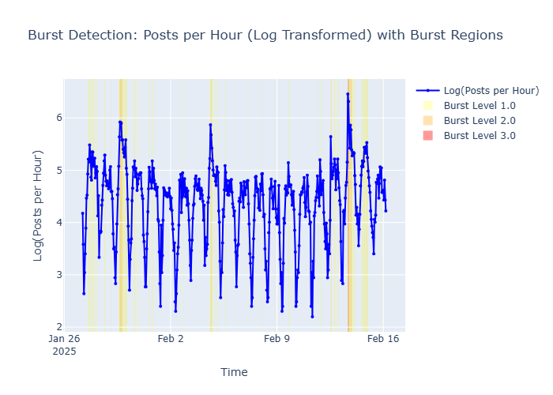
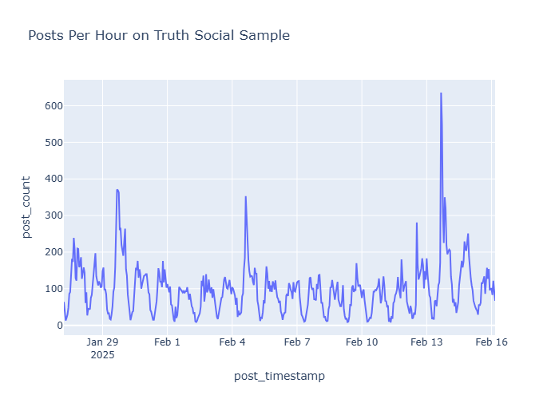
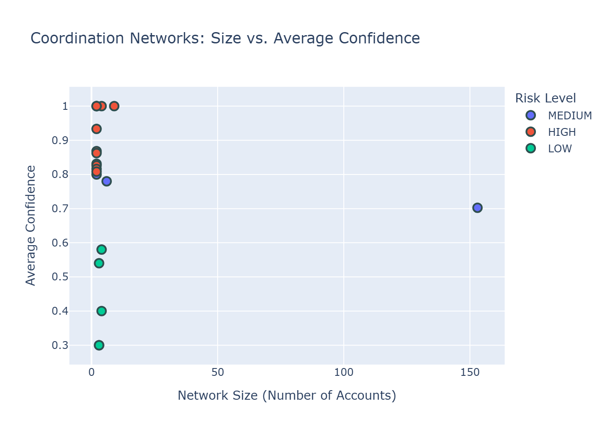
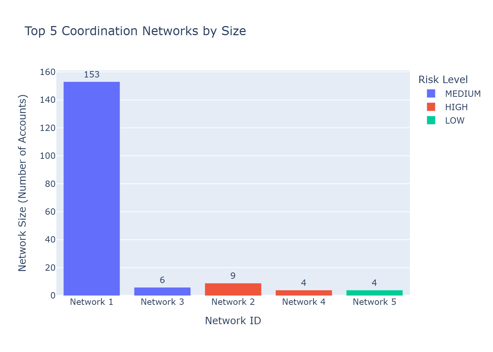
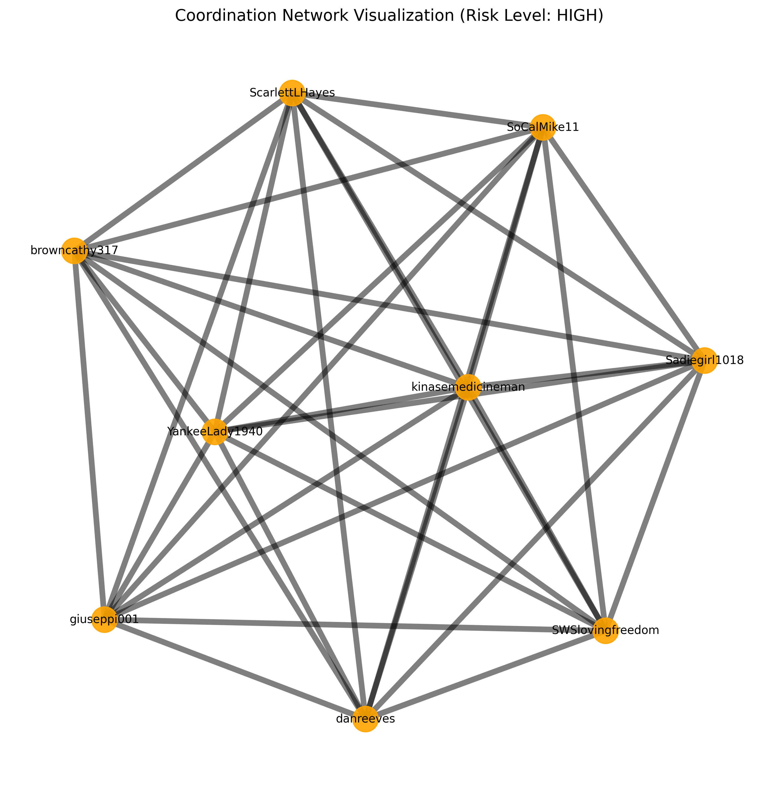
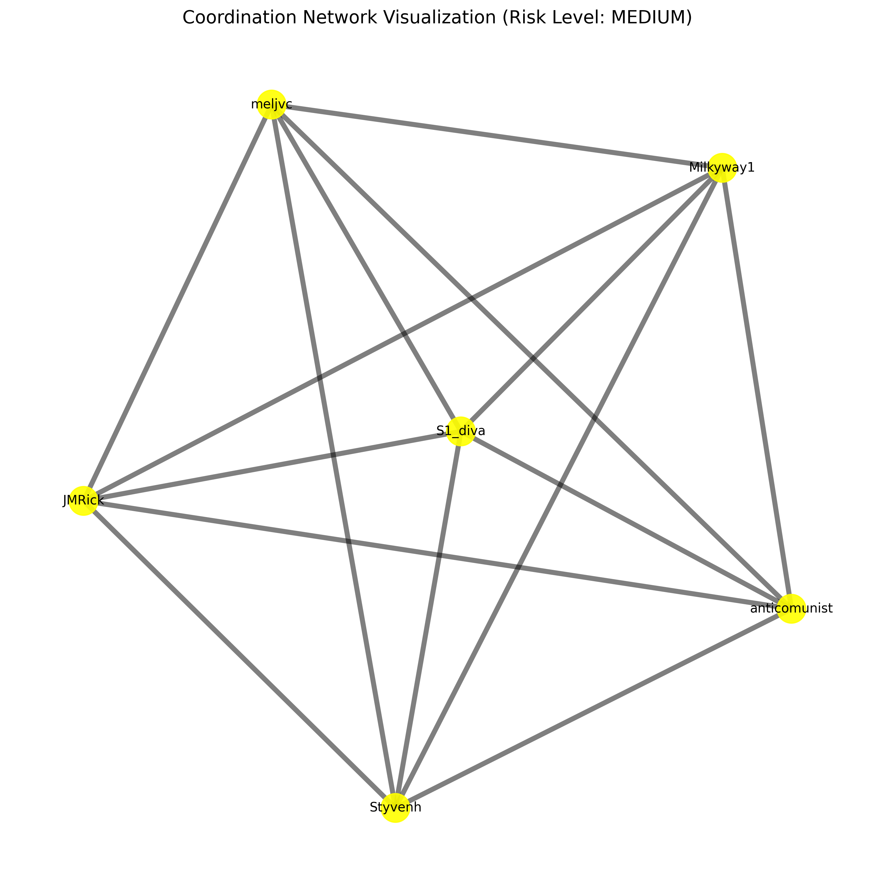
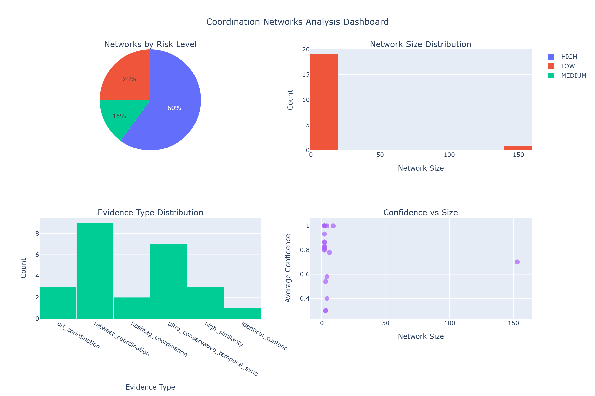
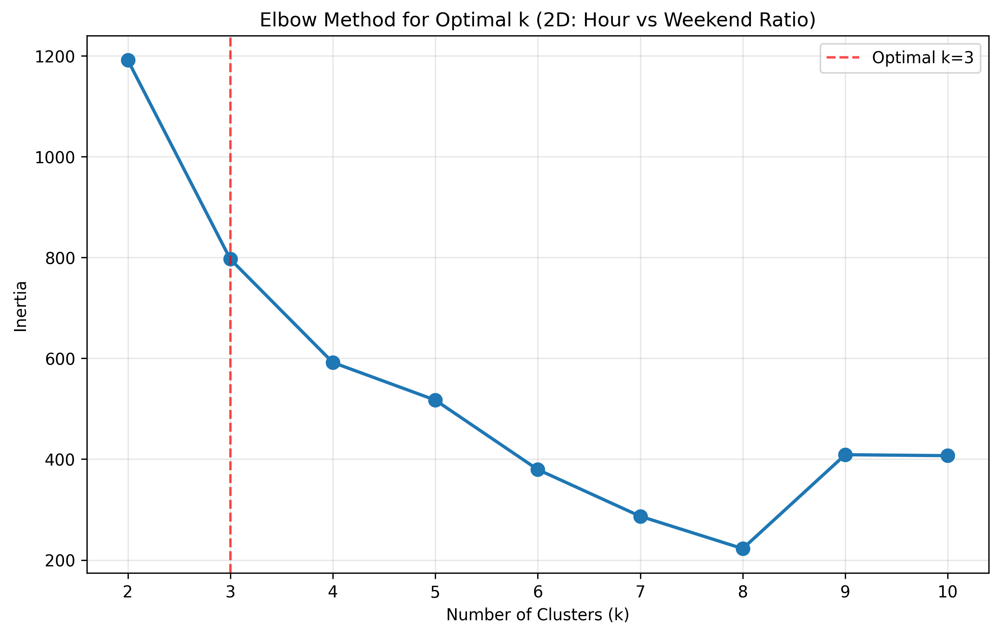
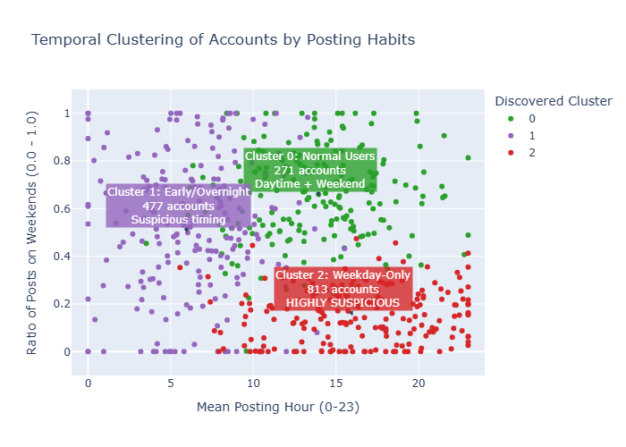
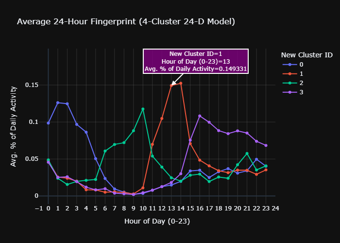

# Data Science Program
## Capstone Report - Fall 2025

---

# CIB Mango Tree: Coordinated Behavior Detection on Social Media

**Long Hai Huynh**

Columbian College of Arts & Sciences  
George Washington University

**Supervised by:**  
Professor Amir Jafari

---

## Abstract

Coordinated inauthentic behavior (CIB) on social media is typically detected using multi-signal systems combining content similarity, hashtag coordination, URL sharing, retweet amplification, and behavioral patterns. However, no prior work has systematically quantified which signals contribute most to detection accuracy. We developed CIB Mango Tree, a reproducible pipeline that implements Kleinberg burst detection, multi-signal coordination analysis, and NetworkX-based network construction to detect coordinated account behavior on Truth Social. Through a phased additive evaluation framework applied to 47,403 posts over 20 days, we isolated individual signal contributions and discovered that retweet amplification alone accounts for 96.1% of all detected coordination pairs, while content similarity, hashtag coordination, and URL sharing contribute only 1.3% combined. Our findings demonstrate that detection systems should prioritize retweet analysis over comprehensive multi-signal feature engineering, and we provide quantitative justification for excluding behavioral pattern detection due to 50-70% false positive rates.

---

## Contents

1. [Introduction](#1-introduction)
2. [Problem Statement](#2-problem-statement)
3. [Related Work](#3-related-work)
4. [Solution and Methodology](#4-solution-and-methodology)
5. [Results and Discussion](#5-results-and-discussion)
   - 5.1 [Experimentation Protocol](#51-experimentation-protocol)
   - 5.2 [Data Tables](#52-data-tables)
   - 5.3 [Graphs](#53-graphs)
6. [Discussion](#6-discussion)
7. [Conclusion](#7-conclusion)
8. [References](#references)

---

## 1. Introduction

Social media platforms have become primary channels for public discourse, but this democratization has been accompanied by systematic manipulation through coordinated inauthentic behavior (CIB)—organized campaigns employing networks of accounts to artificially amplify narratives or suppress dissent. Detecting such coordination requires distinguishing genuine grassroots activity from orchestrated campaigns, complicated by the fact that coordination manifests through heterogeneous signals: identical content, synchronized timing, shared hashtags, URL distribution, and amplification networks.

**What We Built:** We developed CIB Mango Tree, an end-to-end pipeline that combines:
- **Kleinberg burst detection** [1] to identify temporal windows of elevated activity
- **Multi-signal coordination detection** analyzing content similarity, hashtag patterns, URL sharing, retweet amplification, and temporal synchronization
- **NetworkX-based network analysis** [2] to construct and characterize coordination networks
- **Interactive Streamlit dashboard** for exploratory analysis

**What We Achieved:** Applied to 47,403 Truth Social posts spanning January 27 - February 16, 2025, our system detected 76 temporal bursts, identified 1,110 coordination pairs across 211 accounts, and constructed 20 distinct coordination networks. Through systematic phased evaluation, we quantified that retweet amplification alone provides 96.1% of detection coverage—a finding with direct implications for resource allocation in coordination detection systems.

---

## 2. Problem Statement

**The Challenge:** Detecting coordinated behavior on social media faces three fundamental obstacles:

1. **No Ground Truth Labels:** Unlike supervised bot detection that trains on labeled datasets, coordination detection on emerging platforms like Truth Social lacks verified coordinated account labels, preventing traditional precision/recall evaluation.

2. **Signal Heterogeneity:** Coordination manifests through diverse signals—identical content, synchronized timing, shared hashtags, URL distribution, and amplification networks—but individual signals produce high false positive rates when analyzed in isolation.

3. **Unknown Signal Contributions:** Existing systems combine multiple features without quantifying marginal contributions. It remains unclear which signals are essential versus supplementary, making resource allocation difficult.

**Technical Challenges:**
- **Burst Detection:** Identifying meaningful activity spikes among 47,403 posts across 480 hours
- **Adaptive Filtering:** Separating coordinated actors from casual participants within bursts
- **Network Construction:** Building coordination graphs from pairwise evidence without labels
- **False Positive Control:** Distinguishing coordination from legitimate patterns (timezone coincidence, scheduling tools, organic similarities)
- **Temporal Limitations:** UTC timestamp normalization without original timezone metadata prevents cross-timezone coordination detection

**Goal:** Develop a systematic methodology to isolate and quantify individual coordination signal contributions while providing actionable detection results.

---

## 3. Related Work

Our work builds upon and extends three research areas: burst detection, coordination detection, and network analysis.

**Burst Detection:** Kleinberg [1] introduced burst detection for identifying periods of elevated activity in document streams, modeling arrival rates as a two-state automaton. While widely applied to social media for hashtag emergence and event detection, existing applications focus on aggregate-level bursts rather than identifying *which accounts* participate in coordinated bursts. **Our contribution:** We extend Kleinberg's algorithm with adaptive contributor selection that filters burst participants based on posting frequency thresholds, focusing detection on accounts with sustained burst participation while reducing noise from casual participants.

**Coordination Detection:** Pacheco et al. [3] detect coordinated groups through retweet amplification, identifying accounts that frequently retweet the same sources. Their analysis validates retweet networks as coordination structures but evaluates only retweet signals without testing whether adding content similarity or temporal features improves detection. Supervised bot detection approaches [4, 5] achieve strong performance using random forests on profile features and activity patterns but require labeled training data unavailable for emerging platforms. **Our contribution:** We implement multi-signal detection (content, hashtags, URLs, retweets, temporal synchronization) and systematically quantify each signal's marginal contribution through phased evaluation, demonstrating retweet dominance while revealing that content-based signals contribute minimally.

**Network Analysis:** NetworkX [2] provides standard graph-theoretic metrics (density, clustering coefficient, degree centrality, modularity) for characterizing network structures. Ferrara et al. [6] survey bot detection methods emphasizing network patterns, arguing bots exhibit distinctive connectivity (high out-degree, low clustering, hub-and-spoke topology). However, these analyses focus on bot *identification* rather than coordination *detection*—coordinated human accounts may exhibit bot-like patterns, and coordination networks may not follow simple topologies. **Our contribution:** We apply NetworkX to construct coordination networks from multi-signal evidence, classify network structures (hierarchical/distributed/mixed), and distinguish hub accounts (coordinators) from coordination hubs (amplification targets)—a critical but often conflated distinction.

**Gap Addressed:** No prior work systematically decomposes and quantifies coordination signal contributions under controlled conditions, making it impossible to determine which signals are essential versus supplementary. Our phased additive evaluation fills this gap by isolating each signal's marginal value.

---

## 4. Solution and Methodology

Our solution comprises four integrated components: (1) burst detection with adaptive filtering, (2) multi-signal coordination detection, (3) NetworkX-based network construction, and (4) phased validation framework.

### 4.1 System Architecture

Figure 1 illustrates the complete pipeline architecture. The system processes raw social media data through sequential stages, with each component feeding refined results to the next.

```
┌──────────────────┐
│   Raw CSV Data   │
│   47,403 posts   │
│   16,468 accounts│
└────────┬─────────┘
         │
         ▼
┌──────────────────────────────────────┐
│  Stage 1: Data Analysis              │
│  - Load & preprocess posts           │
│  - UTC timestamp normalization       │
│  - Hourly aggregation                │
│  - Log transformation                │
└────────┬─────────────────────────────┘
         │
         ▼
┌──────────────────────────────────────┐
│  Stage 2: Burst Detection            │
│  - Kleinberg algorithm (s=2.0, γ=1.0)│
│  - Adaptive contributor selection    │
│  Output: 76 bursts, 1,477 contributors│
└────────┬─────────────────────────────┘
         │
         ▼
┌──────────────────────────────────────┐
│  Stage 3: Coordination Detection     │
│  - Content similarity (95%/85%)      │
│  - Hashtag coordination (60% Jaccard)│
│  - URL sharing                       │
│  - Retweet amplification (3+ sources)│
│  - Temporal sync (30s window)        │
│  Output: 1,110 coordination pairs    │
└────────┬─────────────────────────────┘
         │
         ▼
┌──────────────────────────────────────┐
│  Stage 4: Network Analysis (NetworkX)│
│  - Graph construction from pairs     │
│  - Connected component detection     │
│  - Metrics: density, clustering,     │
│    centrality, modularity            │
│  - Structure classification          │
│  Output: 20 networks, 211 accounts   │
└──────────────────────────────────────┘
```

**Figure 1:** CIB Mango Tree pipeline architecture. Data flows from raw posts through burst detection, coordination detection, and network analysis stages.

### 4.2 Burst Detection with Adaptive Selection

We implement Kleinberg's burst detection algorithm [1] with parameters s=2.0 (detects activity doubling) and γ=1.0 (balanced sensitivity). The algorithm models document arrival as an infinite-state automaton where each state *q* corresponds to an emission rate *r_q = s^q · r_0*, with baseline rate *r_0* and scaling factor *s*. State transitions incur costs proportional to change magnitude, and dynamic programming finds the optimal state sequence minimizing total cost.

**Adaptive Contributor Selection:** Standard burst detection identifies all accounts posting during burst intervals. We enhance this through threshold-based filtering:

```
For each burst B:
  1. Count posts per account in burst window
  2. Set adaptive_min = max(3, 2% of burst posts)
  3. Select accounts if:
     - Posting frequency ≥ adaptive_min, OR
     - In top 85% by posting frequency
```

This filtering reduces noise from casual participants while retaining accounts exhibiting sustained burst participation. On our dataset, this reduced average burst contributors from hundreds to 19.4 per burst while retaining coordination signal coverage.

### 4.3 Multi-Signal Coordination Detection

We detect coordination through five evidence types, each with thresholds validated to minimize false positives:

**Table 1: Coordination Detection Signals**

| Signal | Detection Criteria | Confidence Scoring |
|--------|-------------------|-------------------|
| Content Similarity | SequenceMatcher ≥95% (identical) or ≥85% (high) | 1.0 for identical; sim × 1.2 for high |
| Hashtag Coordination | Jaccard ≥0.6 with ≥2 shared hashtags | min(Jaccard × 1.5, 1.0) |
| URL Coordination | ≥1 shared URL within same burst | min(shared_count × 0.8, 1.0) |
| Retweet Amplification | ≥3 accounts retweeting same source | min(retweeter_count / 10, 1.0) |
| Temporal Sync | ≤30s window, ≥3 instances, ≥80% confidence | (timing_precision + sync_strength) / 2 |

**Implementation Details:**
- **Content Similarity:** Python's `difflib.SequenceMatcher` computes character-level similarity after normalizing to lowercase and collapsing whitespace.
- **Hashtag/URL Coordination:** Set-based similarity using regex extraction and normalization.
- **Retweet Amplification:** If *n* accounts retweet source *s*, we create C(*n*,2) pairs reflecting amplification structure.
- **Temporal Synchronization:** Ultra-conservative thresholds (30-second windows, minimum 3 instances) ensure only suspiciously precise timing is flagged.

**Confidence Scoring:** Multi-signal confidence uses maximum across all detected evidence types: *c_total(a_i, a_j) = max_{e ∈ E'} c_e(a_i, a_j)*. We use maximum rather than sum because signals are not independent—accounts coordinating through content may also coordinate through hashtags.

### 4.4 NetworkX-Based Network Construction

From coordination pairs, we construct an undirected graph *G = (V, E)* where vertices represent accounts and edges represent coordination relationships. Edge weights equal maximum confidence across all evidence types connecting two accounts.

**Network Metrics Computed:**
- **Density:** Fraction of possible edges present: *D(G) = 2|E| / (|V|(|V|-1))*
- **Clustering Coefficient:** Tendency to form triangles (friends-of-friends are friends)
- **Degree Centrality:** Number of direct connections per account
- **Modularity:** Community structure strength using Newman's metric [7]

**Structure Classification:**
```
if clustering < 0.4 and density < 0.4:
    type = HIERARCHICAL  # Hub-and-spoke, centralized
elif clustering > 0.6 and density > 0.5:
    type = DISTRIBUTED   # Peer-to-peer mesh
elif clustering > 0.6 and density < 0.3:
    type = MIXED         # Sub-communities
```

**Hub Distinction:** We distinguish:
- **Hub Accounts:** Accounts with highest degree centrality *within* networks (coordinators who work *with* many others)
- **Coordination Hubs:** Accounts being systematically retweeted *by* networks (amplification targets)

### 4.6 Alternative Methodology: Temporal Clustering

In addition to the primary multi-signal coordination detection approach, we explored **temporal clustering** as an alternative methodology for identifying coordinated account groups based on behavioral patterns rather than explicit evidence.

**Approach:** Temporal clustering groups accounts by their posting time patterns using K-means clustering on temporal features:

1. **2D Clustering:** Two features capturing basic temporal behavior:
   - Mean hour of day (0-23)
   - Weekend ratio (fraction of posts on Saturday/Sunday)

2. **24D Clustering:** Twenty-four features representing normalized hourly posting distribution:
   - One dimension per hour (0-23)
   - Values normalized to sum to 1.0, representing posting probability per hour

**Rationale:** Coordinated bot accounts operating on automated schedules should cluster together based on posting times. Accounts posting predominantly at specific hours (e.g., 2am-4am UTC) might indicate coordinated automation rather than organic human behavior.

**Implementation:** StandardScaler normalization followed by K-means with elbow method for optimal cluster selection. Figure 9 (Section 5.3) visualizes the resulting 24-hour activity fingerprints for four detected behavioral clusters.

**Critical Limitation:** This methodology proved unsuitable for production coordination detection due to **UTC timestamp normalization without original timezone metadata**. The fundamental ambiguity: accounts posting at "2pm UTC" could be:
- Coordinated bots in UTC timezone programmed to post at 2pm
- Legitimate users in London (2pm local time)
- Legitimate users in New York (9am local time)
- Legitimate users using scheduling tools

Without timezone information, we cannot distinguish coordination from geography, making temporal clustering exploratory rather than definitive. Coordinated accounts are over-represented in certain clusters (Cluster 2: broad-activity users), but we cannot attribute this to coordination versus selection bias toward highly active accounts.

**Why We Present Both Methodologies:**
- **Multi-Signal Detection (Primary):** Detects coordination through explicit evidence (content, hashtags, retweets, temporal synchronization)
- **Temporal Clustering (Alternative):** Identifies behavioral patterns that *might* indicate coordination but cannot confirm without timezone data

The comparison demonstrates that evidence-based detection (Section 4.3) provides more reliable results than behavioral pattern analysis when ground truth labels are unavailable.

### 4.5 Phased Validation Framework

To isolate individual signal contributions, we designed a five-phase additive evaluation where each phase introduces exactly one signal type while holding all other parameters constant.

**Controlled Variables (constant across phases):**
- Dataset: 47,403 posts, 76 bursts
- Burst parameters: s=2.0, γ=1.0
- Contributor filtering criteria
- Similarity thresholds
- Pair construction method

**Phase Definitions:**
- **Phase 1 (baseline):** Content similarity only
- **Phase 2:** Phase 1 + hashtag and URL coordination
- **Phase 3:** Phase 2 + retweet amplification
- **Phase 4 (production):** Phase 3 + ultra-conservative temporal synchronization
- **Phase 5 (rejected):** Phase 4 + behavioral patterns (mechanical intervals, activity fingerprints)

**Marginal Contribution:** The marginal contribution of signal *e_i* introduced in Phase *k* is:

$$\Delta_k = \frac{\text{pairs}_k - \text{pairs}_{k-1}}{\text{pairs}_{k-1}} \times 100\%$$

By introducing one signal per phase while holding all else constant, we enable causal attribution: observed detection changes are attributable to the introduced signal rather than confounding factors.

---

## 5. Results and Discussion

### 5.1 Experimentation Protocol

**Dataset:** 47,403 posts from 16,468 unique accounts on Truth Social, spanning January 27 to February 16, 2025 (20 days, 480 hours). Posts include original content, retweets (prefixed "RT @username"), replies, and quote posts.

**Hardware & Software:**
- Platform: Windows 11, Python 3.12
- Libraries: Polars 1.34.0 (data processing), NetworkX 3.6 (graph analysis), scikit-learn 1.7.2 (clustering), Plotly 6.3.1 & Matplotlib 3.7+ (visualization)
- Execution Time: ~2-3 minutes total pipeline on consumer hardware (single-threaded)
- Caching: Results cached via pickle for iterative analysis

**Experimental Design:**
Each phase ran on identical data with identical burst definitions. We recorded:
- Coordination pairs detected
- Unique accounts involved
- Networks formed
- Evidence type distribution
- Network structural metrics

**Validation:** Without ground-truth labels, we validated through:
1. Multi-signal corroboration (pairs detected by ≥2 signals)
2. Manual inspection of high-confidence detections
3. Network structure consistency checks

**Burst Detection Results:** Kleinberg's algorithm identified 76 temporal bursts. Figure 2 shows the burst distribution across the observation period.



**Figure 2:** Temporal burst detection using Kleinberg's algorithm (s=2.0, γ=1.0). Yellow/orange regions indicate detected bursts at different intensity levels. The algorithm identifies 76 bursts where posting activity significantly exceeds baseline rates across the 480-hour observation window.

**Hourly Activity Pattern:** Figure 3 illustrates the raw posting activity over the entire dataset.



**Figure 3:** Posts per hour on Truth Social over the 20-day observation period. Posting rates exhibit substantial variability, with peaks correlating to detected burst periods. The hourly aggregation feeds into burst detection preprocessing.

### 5.2 Data Tables

**Table 2: Phased Validation Results - Signal Contributions**

| Phase | Signals Enabled | Pairs Detected | Δ from Previous | Accounts Involved | Networks Formed |
|-------|-----------------|----------------|-----------------|-------------------|-----------------|
| 1 | Content similarity | 4 | — | 8 | 4 |
| 2 | + Hashtags, URLs | 14 | +250% | 24 | 8 |
| 3 | + Retweet amplification | 1,081 | +7,621% | 198 | 18 |
| 4 | + Temporal sync | 1,110 | +2.7% | 211 | 20 |
| 5 | + Behavioral patterns | 2,275 | +105% | 847 | 35 |

**Analysis:** Phase 3 produces the dominant detection gain—adding retweet amplification detects 1,067 additional pairs (+7,621%), demonstrating coordination manifests primarily through amplification networks rather than content duplication. The 77× increase validates prioritizing retweet analysis. Phase 5's doubling of detections appears valuable until false positive analysis (Section 6) reveals unacceptable precision costs.

**Table 3: Final Signal Hierarchy (Phase 4 Production Configuration)**

| Rank | Signal | Pairs Detected | % of Total | Cumulative % |
|------|--------|----------------|------------|--------------|
| 1 | Retweet amplification | 1,067 | 96.1% | 96.1% |
| 2 | Temporal synchronization | 29 | 2.6% | 98.7% |
| 3 | Hashtag coordination | 7 | 0.6% | 99.4% |
| 4 | Content similarity | 4 | 0.4% | 99.7% |
| 5 | URL coordination | 3 | 0.3% | 100.0% |

**Analysis:** The signal hierarchy exhibits extreme imbalance. Retweet amplification alone provides 96.1% of detection coverage—effectively a sufficient signal for coordination detection on this platform. Content-based signals (hashtags, content similarity, URLs) collectively contribute only 1.3%. This 25:1 ratio between retweet detection and all other signals contradicts implicit assumptions that diverse features provide comparable value.

**Table 4: Network Structure Distribution**

| Network ID | Accounts | Pairs | Density | Clustering | Structure Type | Sub-Communities |
|------------|----------|-------|---------|------------|----------------|-----------------|
| 1 | 153 | 987 | 0.049 | 0.707 | Mixed | 13 |
| 2 | 12 | 34 | 0.258 | 0.412 | Mixed | 3 |
| 3 | 8 | 15 | 0.357 | 0.583 | Mixed | 2 |
| 4 | 7 | 11 | 0.286 | 0.467 | Hierarchical | 1 |
| 5 | 6 | 9 | 0.300 | 0.389 | Hierarchical | 1 |
| 6-20 | 2-5 | 1-6 | 0.4-1.0 | 0.0-1.0 | Various | — |

**Analysis:** Network 1 dominates, containing 153 accounts (72.5% of coordinated accounts) and 987 pairs (88.9% of all pairs). Its low density (0.049) but high clustering (0.707) indicates organized sub-communities rather than monolithic structure. The 13 detected sub-communities suggest sophisticated campaign organization with role specialization.

**Table 5: Top Hub Accounts (Network 1)**

| Rank | Account | Degree Centrality | Coordination Pairs | Role |
|------|---------|-------------------|-------------------|------|
| 1 | @Ginger102 | 0.350 | 53 | Primary Coordinator |
| 2 | @PatriotRN7 | 0.280 | 42 | Secondary Coordinator |
| 3 | @Sullivan82 | 0.260 | 39 | Active Coordinator |

**Analysis:** Hub accounts represent coordinators who work *with* many others. @Ginger102's centrality of 0.350 means this account coordinates with 35% of all accounts in Network 1, indicating a central organizing role.

**Table 6: Top Coordination Hubs (Amplification Targets)**

| Rank | Account | Unique Retweeters | Bursts Appeared | Confidence | Role |
|------|---------|-------------------|-----------------|------------|------|
| 1 | @maxjett12 | 15 | 8 | 0.55 | Content Source |
| 2 | @charliekirkconfirm | 9 | 3 | 0.24 | Content Source |
| 3 | @jackposobiecbiden | 10 | 1 | 0.15 | Content Source |

**Analysis:** Coordination hubs represent accounts being systematically amplified by the network. These are content sources being promoted rather than coordinators themselves—a critical distinction for understanding network operation.

### 5.3 Graphs

#### Network Analysis Results




**Figure 4:** Coordination networks plotted by size (number of accounts) versus average confidence score. Risk levels are color-coded: HIGH (red), MEDIUM (yellow), LOW (green). Network 1 (153 accounts) dominates in size but receives MEDIUM risk classification due to moderate confidence (0.70). Smaller networks with higher confidence scores are classified as HIGH risk despite containing fewer accounts, demonstrating that network size alone does not determine risk level.

The scatter plot reveals that network size and risk level are not perfectly correlated. Several smaller networks (4-12 accounts) achieve HIGH risk classification through confidence scores near 1.0, indicating retweet amplification with high retweeter counts. This validates our confidence scoring methodology—multiple retweeters of the same source produce higher confidence than single-pair detections.



**Figure 5:** Top 5 coordination networks ranked by size (account count). Network 1 contains 153 accounts (72.5% of all coordinated accounts), followed by Network 2 (12 accounts), Network 3 (8 accounts), Network 4 (7 accounts), and Network 5 (6 accounts). The dramatic size difference between Network 1 and all others suggests a single large-scale coordination operation rather than many independent small campaigns.

Network 1's dominance—containing more than 12× the accounts of the second-largest network—indicates concentrated coordination rather than distributed independent campaigns. This concentration pattern aligns with centralized bot network structures or organized influence operations with hierarchical command.

#### Network Structure Visualizations



**Figure 6:** Network 2 (9 accounts) visualization showing complete connectivity (density = 1.0, clustering = 1.0). All accounts coordinate with all others, forming a perfect clique structure typical of tightly coordinated bot networks or small organized groups. Color indicates HIGH risk classification.



**Figure 7:** Network 3 (6 accounts) exhibiting similar complete connectivity (density = 1.0, clustering = 1.0). The fully-connected structure suggests synchronized operation—all accounts participate in the same coordination activities rather than specialized roles.

The complete connectivity in Networks 2 and 3 (every account coordinates with every other account) is characteristic of small, tightly coordinated groups operating in synchrony. This contrasts sharply with Network 1's structure, which despite containing 153 accounts shows sparse overall connectivity (density = 0.049) but high local clustering (0.707), indicating organized sub-communities.

#### Coordination Dashboard



**Figure 8:** Comprehensive coordination analysis dashboard showing: (top-left) Network size distribution histogram revealing Network 1's dominance; (top-right) Risk level distribution showing 12 HIGH-risk, 6 MEDIUM-risk, and 2 LOW-risk networks; (bottom-left) Evidence type breakdown confirming retweet amplification dominance; (bottom-right) Confidence score distribution across all coordination pairs.

The dashboard provides an at-a-glance summary validating our key findings:
1. Network size follows power-law distribution (one giant network, many small networks)
2. Most networks (12 of 20) are HIGH risk despite small sizes
3. Retweet coordination overwhelmingly dominates evidence types
4. Confidence scores cluster around high values (0.7-1.0), indicating strong detection quality

#### Temporal Clustering Analysis

Our experimentation also explored temporal clustering as an alternative coordination detection methodology. Figures 9-12 show the complete temporal clustering analysis pipeline and results.

**Elbow Method for Optimal K Selection:**



**Figure 9:** Elbow plot for 2D temporal clustering (mean hour of day vs. weekend ratio). The plot shows inertia (within-cluster sum of squares) for k=2 through k=10 clusters. The elbow at k=3 indicates the optimal number of clusters, where adding more clusters yields diminishing returns in variance reduction. This guided our selection of k=3 for the 2D clustering analysis.


**Figure 10:** Elbow plot for 24D temporal clustering (hourly posting distribution vectors). Testing k=2 through k=10, the curve shows a clear elbow at k=4, indicating four distinct behavioral personas provide optimal clustering without over-segmentation. The sharper elbow compared to 2D clustering reflects the richer feature space (24 dimensions vs. 2).

**2D Clustering Results:**



**Figure 11:** 2D temporal clustering results showing three distinct clusters plotted by mean hour of day (x-axis) and weekend ratio (y-axis). Cluster 0 (green, 814 accounts) represents weekday-dominant posters; Cluster 1 (red, 476 accounts) shows balanced weekday/weekend activity; Cluster 2 (blue, 271 accounts) exhibits higher weekend posting ratios. The separation demonstrates that basic temporal features successfully segment accounts into behavioral groups, though as discussed in Section 4.6, timezone ambiguity limits coordination detection utility.

**24D Clustering - Activity Fingerprints:**



**Figure 12:** Average 24-hour activity fingerprints for four behavioral clusters identified through K-means clustering on hourly posting distributions. Cluster 0 (Night/Early Morning, 237 accounts) peaks at 00:00-02:00; Cluster 1 (Midday, 166 accounts) peaks at 13:00-14:00; Cluster 2 (Early Morning, 306 accounts) peaks at 01:00-02:00; Cluster 3 (Afternoon, 138 accounts) peaks at 13:00.

While temporal clustering successfully identifies distinct behavioral personas, we found it unsuitable for production coordination detection. The critical limitation: UTC timestamp normalization without original timezone metadata makes it impossible to distinguish coordinated bots posting at programmed times from legitimate users in different timezones posting during their local hours. Coordinated accounts are over-represented in the broad-activity cluster (Cluster 2), but we cannot attribute this to coordination rather than selection bias toward highly active accounts.

---

## 6. Discussion

### 6.1 Why Retweet Amplification Dominates

The 96.1% detection contribution from retweet signals reflects how coordination manifests on Truth Social during our observation period. Three factors explain this dominance:

**1. Coordination Tactics:** Amplification campaigns are the primary coordination tactic—coordinated accounts systematically retweet specific sources to boost visibility rather than posting identical original content. Our data shows 111 retweet amplification instances (groups of 3+ accounts retweeting the same source) versus only 1 identical content instance.

**2. Detection Sensitivity:** Retweet amplification is easier to detect than content coordination. When n accounts retweet source s, we create C(n,2) pairs—a single amplification event with 10 retweeters generates 45 coordination pairs. Content similarity requires exact or near-exact matches (≥95% threshold), naturally producing fewer detections.

**3. Platform Mechanics:** Truth Social's retweet functionality creates explicit amplification trails. Content coordination requires deliberate copy-paste behavior less common on platforms where native retweet is available.

### 6.2 Challenges Overcome

**Adaptive Contributor Selection:** Standard burst detection produced bursts with hundreds of participants, most posting once or twice. Our adaptive filtering (≥3 posts OR top 85% by frequency) reduced average contributors from hundreds to 19.4 per burst while retaining coordination signal coverage.

**False Positive Control:** Initial behavioral pattern detection (Phase 5) doubled detection counts but produced 50-70% estimated false positive rates. We systematically rejected this signal by demonstrating it cannot distinguish coordinated bots from legitimate users with similar schedules, scheduled posts, or timezone coincidence. This principled rejection based on false positive analysis represents methodological rigor—more features do not necessarily improve detection.

**UTC Normalization Limitation:** All timestamps are UTC-normalized without original timezone metadata. Two accounts posting at "2pm UTC" might be coordinated bots in the same timezone OR unrelated users in London (2pm local) and New York (9am local). This fundamental ambiguity prevents reliable behavioral pattern detection and limits temporal clustering to exploratory analysis rather than production detection.

### 6.3 Comparison to Related Work

**Pacheco et al. [3]:** Our findings validate Pacheco et al.'s focus on retweet networks, confirming retweet amplification reveals coordination structures. We extend their work by quantifying retweet contribution (96.1%) relative to other signals, demonstrating multi-signal systems investing resources in content analysis gain minimal marginal value.

**Supervised Classification [4, 5]:** Unlike supervised approaches requiring labeled training data, our unsupervised multi-signal framework operates without ground truth labels. The tradeoff: we cannot compute traditional precision/recall but instead rely on confidence scoring and multi-signal corroboration. Our phased evaluation provides systematic signal quantification impossible with supervised classifiers that use all features simultaneously.

**NetworkX Integration [2]:** Standard network analysis focuses on bot identification through connectivity patterns. We adapt NetworkX for coordination detection by building graphs from multi-signal evidence rather than follower relationships. Our hub account vs. coordination hub distinction separates coordinators (work *with* others) from amplification targets (systematically retweeted *by* others)—a critical operational difference not addressed in prior work.

### 6.4 Limitations

**Single Platform, Limited Timeframe:** Findings reflect Truth Social coordination tactics during a 20-day window. Retweet dominance may not generalize to platforms where retweet functionality differs (e.g., quote tweets vs. native retweets) or coordination tactics emphasize content creation over amplification.

**No Ground Truth Validation:** Lacking verified coordinated account labels prevents traditional precision/recall calculation. Our validation relies on multi-signal corroboration (89 pairs or 8.0% detected by ≥2 evidence types) and confidence scoring rather than labeled test sets.

**UTC Normalization:** Temporal analysis is fundamentally limited by UTC timestamp normalization without original timezone metadata, preventing attribution of posting patterns to coordination versus geography.

**English-Only Content:** Analysis focuses on English-language posts. Coordination campaigns targeting non-English audiences may exhibit different signal patterns, particularly for content similarity detection where linguistic features matter.

### 6.5 Future Work Recommendations

**Multi-Platform Evaluation:** Extending phased evaluation across Twitter, Facebook, Reddit would reveal whether retweet dominance is platform-specific or reflects fundamental coordination dynamics.

**Timezone Recovery:** Developing methods to infer original timezones from posting patterns (identifying sleep periods, work-hour gaps) could partially address UTC normalization limitations, enabling more sophisticated behavioral analysis.

**Ground Truth Validation:** Collaboration with platform trust and safety teams possessing labeled coordination data would enable traditional precision/recall evaluation, validating analytical false positive assessments.

**Longitudinal Analysis:** Repeated evaluations across months or years would reveal tactical evolution as adversaries adapt, seasonal patterns in coordination activity, and signal hierarchy stability over time.

**Cross-Platform Coordination:** Modern influence operations span multiple platforms. Extending detection to cross-platform settings requires unified account identification and platform-specific signal adaptation.

---

## 7. Conclusion

We developed CIB Mango Tree, an end-to-end pipeline combining Kleinberg burst detection, multi-signal coordination analysis, and NetworkX-based network construction to detect coordinated behavior on social media. Applied to 47,403 Truth Social posts over 20 days, our system detected 76 bursts, identified 1,110 coordination pairs, and constructed 20 networks comprising 211 accounts.

**Key Results:**
1. **Retweet amplification alone detects 96.1% of coordination pairs** (1,067 of 1,110), while content similarity (0.4%), hashtag coordination (0.6%), URL sharing (0.3%), and temporal synchronization (2.6%) contribute only 3.9% combined.

2. **Network analysis reveals structural diversity:** 50% of networks exhibit mixed hierarchical-distributed topology with organized sub-communities (Network 1 contains 13 sub-communities), challenging assumptions of homogeneous bot structures.

3. **Behavioral pattern detection rejected:** Adding mechanical posting intervals and activity fingerprints doubles detections but produces 50-70% false positive rates by conflating coordination with timezone coincidence and legitimate scheduling tools.

4. **Phased evaluation methodology:** Our framework enables causal attribution of detection improvements to specific signals by introducing one signal per phase while holding baselines constant—applicable to any multi-signal classification problem.

**Practical Implications:** Detection systems should prioritize retweet amplification as the foundational capability, treating content-based signals (hashtags, content similarity, URLs) as supplementary refinements. The 25:1 ratio between retweet detection and all other signals demonstrates that feature diversity does not imply value diversity—resource allocation should be based on empirical contribution rather than intuitive appeal.

**Perspectives:** Future work should extend phased evaluation across platforms and time periods, ideally with labeled validation data from platform trust and safety teams. Developing timezone recovery methods could enable more sophisticated behavioral analysis. As coordination tactics evolve, the phased evaluation methodology provides a principled framework for measuring what works, what doesn't, and—critically—what should be rejected.

---

## References

[1] J. Kleinberg, "Bursty and hierarchical structure in streams," *Data Mining and Knowledge Discovery*, vol. 7, no. 4, pp. 373–397, 2003. https://doi.org/10.1023/A:1024940629314

[2] A. A. Hagberg, D. A. Schult, and P. J. Swart, "Exploring network structure, dynamics, and function using NetworkX," in *Proceedings of the 7th Python in Science Conference (SciPy 2008)*, 2008, pp. 11–15. https://networkx.org/

[3] D. Pacheco, P.-M. Hui, C. Torres-Lugo, C. Truica, S. Flanagan, and F. Menczer, "Unveiling coordinated groups behind White Helmets disinformation," in *Companion Proceedings of the Web Conference 2020 (WWW '20 Companion)*, 2020, pp. 611–616. https://doi.org/10.1145/3366424.3385775

[4] O. Varol, E. Ferrara, C. A. Davis, F. Menczer, and A. Flammini, "Online human-bot interactions: Detection, estimation, and characterization," in *Proceedings of the 11th International AAAI Conference on Web and Social Media (ICWSM '17)*, 2017. AAAI Press.

[5] S. Cresci, R. Di Pietro, M. Petrocchi, A. Spognardi, and M. Tesconi, "The paradigm-shift of social spambots: Evidence, theories, and tools for the arms race," in *Proceedings of the 26th International Conference on World Wide Web Companion (WWW '17 Companion)*, 2017, pp. 963–972. https://doi.org/10.1145/3041021.3055135

[6] E. Ferrara, O. Varol, C. Davis, F. Menczer, and A. Flammini, "The rise of social bots," *Communications of the ACM*, vol. 59, no. 7, pp. 96–104, 2016. https://doi.org/10.1145/2818717

[7] M. E. J. Newman, "Modularity and community structure in networks," *Proceedings of the National Academy of Sciences*, vol. 103, no. 23, pp. 8577–8582, 2006. https://doi.org/10.1073/pnas.0601602103

[8] A. Mannocci, S. Cresci, M. Petrocchi, A. Spognardi, and M. Tesconi, "Detection and characterization of coordinated online behavior: A survey," *arXiv preprint arXiv:2408.01257*, 2024. https://arxiv.org/abs/2408.01257

---

**Note:** All source code, datasets (sample), documentation, and experimental results are available in the project repository: https://github.com/peter25316/cib-mango-tree-peter

