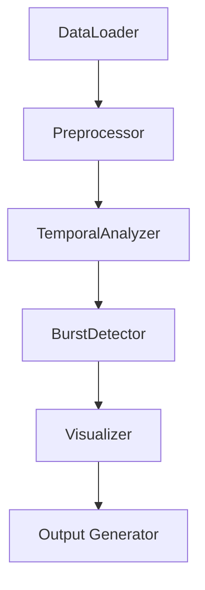

## Date: Week 1 - October 25, 2025
- Topics of discussion
    - Project initialization and setup
    - Data processing requirements
    - Initial architecture design
    - Development environment setup

- Action Items:

* [x] Set up project repository structure
* [x] Initialize Python environment and dependencies
* [x] Create basic component structure
* [x] Design data loading interface
* [x] Plan visualization requirements

---

## Date: Week 2 - November 1, 2025
- Topics of discussion
    - Data preprocessing implementation
    - Visualization framework selection
    - Cache system design
    - Component architecture refinement

- Action Items:

* [x] Implement data loading and preprocessing
* [x] Set up visualization framework
* [x] Create caching system structure
* [x] Design burst detection algorithm
* [x] Initialize testing framework

---

## Date: Week 3 - November 8, 2025
- Topics of discussion
    - Implementation of core analysis components
    - Temporal clustering development and feature engineering
    - K-means clustering implementation with elbow method
    - Visualization system integration
    - Performance optimization strategies

- Action Items:

* [x] Implement temporal feature engineering:
    - Hour of day patterns (mean posting time)
    - Weekend vs weekday activity ratios
    - Hourly activity vectors
    - Total posts per account
* [x] Develop clustering algorithm implementation:
    - K-means clustering with k-means++ initialization
    - Elbow method for optimal cluster count
    - Feature standardization using StandardScaler
* [x] Create visualization system for clustering results
* [ ] Optimize clustering performance
* [ ] Add comprehensive documentation

---

## Technical Implementation Details

### Week 1 Accomplishments
- Created project structure with src/, data/, and visualization directories
- Set up Python environment with required dependencies:
  - Polars for data processing
  - Plotly for interactive visualizations
  - NumPy and SciPy for numerical computations
- Established component-based architecture in src/components/
- Initialized version control and documentation structure

### Week 2 Accomplishments
- Implemented robust data loading system with error handling
- Created visualization framework supporting both static and interactive outputs
- Developed initial caching system using pickle serialization
- Set up data preprocessing pipeline
- Created basic testing structure

### Week 3 Progress
- Implemented comprehensive temporal feature engineering:
  - Temporal features extraction:
    - Hour of day calculations (mean posting time)
    - Day of week patterns
    - Weekend vs weekday activity ratios
    - Hourly activity distribution vectors
    - Account-level posting frequency
  - Feature preprocessing:
    - StandardScaler implementation for feature normalization
    - Filtering for active accounts (minimum post threshold)

- Developed clustering system:
  - Implemented K-means clustering with k-means++ initialization
  - Added elbow method for optimal cluster count determination
  - Created cluster validation metrics
  - Integrated scikit-learn's clustering framework

- Enhanced visualization components:
  - Interactive cluster visualization plots
  - Elbow curve plotting for cluster optimization
  - Temporal pattern distribution graphs
  - Account activity heatmaps

- Optimized processing pipeline:
  - Vectorized feature calculations
  - Implemented efficient data transformations
  - Added caching for intermediate results
  - Optimized memory usage for large datasets

## Visualization Examples


## Current Project Structure
```
src/
  ├── components/
  │   ├── burst_detector.py
  │   ├── data_analyzer.py
  │   ├── kleinberg_utils.py
  │   ├── temporal_clusterer.py
  │   └── visualizer.py
  └── tests/
      └── main.py
```

## Next Steps
- Further optimization of temporal clustering
- Enhanced visualization integration
- Comprehensive testing implementation
- Documentation expansion
- Performance optimization
