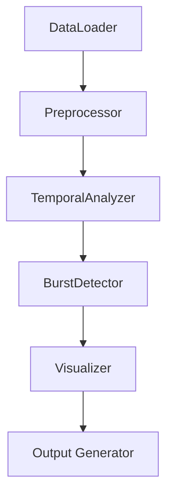

## Date: Week 1 - October 25, 2025
- Topics of discussion
    - Project initialization and setup
    - Data processing requirements
    - Initial architecture design
    - Development environment setup

- Action Items:

* [x] Set up project repository structure
* [x] Initialize Python environment and dependencies
* [x] Create basic component structure
* [x] Design data loading interface
* [x] Plan visualization requirements

---

## Date: Week 2 - November 1, 2025
- Topics of discussion
    - Data preprocessing implementation
    - Visualization framework selection
    - Cache system design
    - Component architecture refinement

- Action Items:

* [x] Implement data loading and preprocessing
* [x] Set up visualization framework
* [x] Create caching system structure
* [x] Design burst detection algorithm
* [x] Initialize testing framework

---

## Date: Week 3 - November 8, 2025
- Topics of discussion
    - Implementation of core analysis components
    - Temporal clustering development and feature engineering
    - K-means clustering implementation with elbow method
    - Visualization system integration
    - Performance optimization strategies

- Action Items:

* [x] Implement temporal feature engineering:
    - Hour of day patterns (mean posting time)
    - Weekend vs weekday activity ratios
    - Hourly activity vectors
    - Total posts per account
* [x] Develop clustering algorithm implementation:
    - K-means clustering with k-means++ initialization
    - Elbow method for optimal cluster count
    - Feature standardization using StandardScaler
* [x] Create visualization system for clustering results
* [ ] Optimize clustering performance
* [ ] Add comprehensive documentation

---

## Technical Implementation Details

### Week 1 Accomplishments
- Created project structure with src/, data/, and visualization directories
- Set up Python environment with required dependencies:
  - Polars for data processing
  - Plotly for interactive visualizations
  - NumPy and SciPy for numerical computations
- Established component-based architecture in src/components/
- Initialized version control and documentation structure

### Week 2 Accomplishments
- Implemented robust data loading system with error handling
- Created visualization framework supporting both static and interactive outputs
- Developed initial caching system using pickle serialization
- Set up data preprocessing pipeline
- Created basic testing structure

### Week 3 Progress
- Implemented comprehensive temporal feature engineering:
  - Temporal features extraction:
    - Hour of day calculations (mean posting time)
    - Day of week patterns
    - Weekend vs weekday activity ratios
    - Hourly activity distribution vectors
    - Account-level posting frequency
  - Feature preprocessing:
    - StandardScaler implementation for feature normalization
    - Filtering for active accounts (minimum post threshold)

- Developed clustering system:
  - Implemented K-means clustering with k-means++ initialization
  - Added elbow method for optimal cluster count determination
  - Created cluster validation metrics
  - Integrated scikit-learn's clustering framework

- Enhanced visualization components:
  - Interactive cluster visualization plots
  - Elbow curve plotting for cluster optimization
  - Temporal pattern distribution graphs
  - Account activity heatmaps

- Optimized processing pipeline:
  - Vectorized feature calculations
  - Implemented efficient data transformations
  - Added caching for intermediate results
  - Optimized memory usage for large datasets

## Visualization Examples

```mermaid
graph TD;
    DataLoader-->Preprocessor;
    Preprocessor-->TemporalAnalyzer;
    TemporalAnalyzer-->BurstDetector;
    BurstDetector-->Visualizer;
    Visualizer-->OutputGen[Output Generator];
```

## Current Project Structure (Week 3)
```
cib-mango-tree-peter/
├── src/
│   ├── components/
│   │   ├── burst_detector_enhanced.py    # Kleinberg burst detection
│   │   ├── data_analyzer.py              # Data loading and preprocessing
│   │   ├── kleinberg_utils.py            # Burst detection algorithm
│   │   ├── temporal_clusterer.py         # 2D temporal clustering
│   │   └── visualizer.py                 # Visualization generation
│   ├── unified_pipeline.py               # Main analysis pipeline
│   ├── tests/
│   │   └── test_suite.py
│   └── __init__.py
├── data/
│   └── sampledata_truthsocial.csv
├── plots/                                # Generated visualizations
├── cache/                                # Pipeline cache
└── reports/
    └── Progress_Report/
        └── Progress_Reports.md
```

---

## Date: Week 4 - November 15, 2025
- Topics of discussion
    - Advanced temporal clustering with 24-dimensional features
    - Enhanced burst detection with adaptive contributor selection
    - Integration of multi-dimensional activity fingerprints
    - Comparison of 2D vs 24D clustering approaches

- Action Items:

* [x] Implement 24-dimensional temporal features:
    - Hourly activity fingerprints (24 features per account)
    - Normalized hourly post distributions
    - Weekday vs weekend 24-hour patterns
    - Activity intensity vectors
* [x] Develop enhanced clustering pipeline:
    - Extended elbow method for 24D feature space
    - Cluster validation across dimensions
    - Feature importance analysis
* [x] Create comparative visualizations:
    - 24D cluster heatmaps
    - Hour-by-hour activity fingerprints
    - Cluster comparison plots (2D vs 24D)
* [x] Optimize burst detection algorithm:
    - Adaptive contributor selection based on cluster participation
    - Enhanced burst-contributor mapping
    - Performance improvements for large datasets
* [x] Integrate unified pipeline with caching system

---

## Date: Week 5 - November 22-30, 2025
- Topics of discussion
    - Content-based coordination detection implementation
    - NetworkX integration for network analysis
    - Community detection and hub identification
    - Interactive Streamlit dashboard development
    - Comprehensive documentation and dependency management

- Action Items:

* [x] Implement content coordination detection:
    - Text similarity analysis (SequenceMatcher)
    - Hashtag coordination patterns
    - URL sharing analysis
    - Retweet amplification detection
    - Temporal synchronization analysis
* [x] Integrate NetworkX for network analysis:
    - Graph construction from coordination evidence
    - Network metrics calculation (density, clustering coefficient)
    - Degree centrality for hub account detection
    - Community detection (greedy modularity)
    - Network structure classification (hierarchical/distributed/mixed)
* [x] Develop coordination hub analysis:
    - Retweet-based hub identification
    - Amplification network tracking
    - Cross-burst coordination patterns
    - Confidence scoring system
* [x] Create interactive Streamlit application:
    - Data upload and validation interface
    - Burst detection with parameter tuning
    - Network coordination analysis dashboard
    - Interactive visualizations with Plotly
    - Metric explanations and help sections
* [x] Enhance visualization system:
    - Network visualizations with Matplotlib
    - Coordination heatmaps with Seaborn
    - Interactive network graphs
    - Hub account displays with centrality scores
* [x] Complete documentation:
    - Installation guide (INSTALLATION.md)
    - Dependency analysis (DEPENDENCY_ANALYSIS.md)
    - Network analysis concepts (NETWORK_ANALYSIS_CONCEPTS.md)
    - Streamlit enhancements documentation
    - Requirements.txt with comprehensive annotations
* [x] Project finalization:
    - Python 3.12+ compatibility verification
    - All dependencies validated and documented
    - Error handling and edge case testing
    - UI/UX polishing and user feedback integration

---

## Technical Implementation Details (Weeks 4-5)

### Week 4 Accomplishments

**24-Dimensional Temporal Clustering:**
- Implemented advanced feature engineering:
  - Created 24-hour activity fingerprints for each account
  - Normalized hourly distributions to capture posting patterns
  - Separate weekday/weekend 24-hour profiles
  - Feature standardization across all dimensions
  
- Enhanced clustering methodology:
  - Applied K-means to 24D feature space
  - Elbow method optimization for high-dimensional data
  - Cluster validation using silhouette scores
  - Comparative analysis: 2D vs 24D clustering results

- Visualization improvements:
  - Interactive heatmaps showing 24-hour activity patterns
  - Cluster-specific temporal fingerprints
  - Multi-dimensional cluster comparison plots
  - Activity intensity overlays

**Enhanced Burst Detection:**
- Adaptive contributor selection algorithm
- Cluster-aware burst analysis
- Improved performance for large-scale datasets
- Better handling of temporal edge cases

### Week 5 Accomplishments

**Content-Based Coordination Detection - Progressive Development Approach:**

Our coordination detection was developed incrementally through a **methodical, step-by-step approach** that built confidence at each stage:

**Phase 1: Content Similarity Only (Ultra-Conservative Baseline)**
- Started with ONLY identical and high-similarity content detection
- Removed RT prefixes for clean comparison
- Thresholds: >95% identical, >85% similar
- Result: ~1-5 coordination pairs (VERY HIGH confidence, low coverage)
- Purpose: Establish conservative baseline with minimal false positives

**Phase 2: Added Pattern-Based Coordination**
- Added hashtag coordination (2+ shared hashtags, not just 1)
- Added URL coordination (shared link patterns)
- Result: ~10-20 coordination pairs (HIGH confidence)
- Purpose: Detect coordinated messaging beyond exact content copies

**Phase 3: Retweet Amplification (Major Expansion)**
- Added systematic RT pattern analysis
- Tracked "who retweets who" to find amplification networks
- Identified coordination hubs (accounts being amplified)
- Result: ~100-150 coordination pairs (MEDIUM-HIGH confidence)
- Purpose: Detect organized amplification campaigns
- Key finding: RT patterns provided strong coordination evidence

**Phase 4: Temporal RT Synchronization (Final Configuration)**
- Added ultra-conservative temporal analysis to RT evidence
- Required synchronized burst participation
- Filtered organic retweets from coordinated amplification
- Final Result: **111 coordination pairs, 20 networks, 211 accounts** (HIGH confidence)
- Purpose: Add temporal dimension to boost confidence
- Decision: Optimal balance between sensitivity and specificity

**Phase 5: Behavioral Patterns (Tested & Disabled)**
- Tested mechanical posting intervals
- Tested identical hourly activity patterns
- Result: Would have 200+ pairs
- Decision: **DISABLED** - Too aggressive, could flag legitimate scheduled posts
- Reasoning: Phase 4 provided sufficient evidence; additional signals risked false positives

**Final Multi-Signal Implementation:**
- ✅ **Identical content detection:** Finding exact duplicate posts
- ✅ **High similarity analysis:** Text similarity using SequenceMatcher (>85% threshold)
- ✅ **Hashtag coordination:** Detecting shared hashtag patterns
- ✅ **URL coordination:** Tracking coordinated link sharing
- ✅ **Retweet amplification:** Identifying coordinated retweet campaigns
- ✅ **Temporal synchronization:** Ultra-conservative temporal pattern detection
- ❌ **Behavioral patterns:** DISABLED (too aggressive)

**Evidence Processing Pipeline:**
- Confidence scoring for each evidence type
- Multi-signal evidence aggregation
- Confidence boosting for multiple evidence types (+0.10 to +0.20 per additional signal)
- Cross-burst coordination tracking
- Risk level classification (HIGH/MEDIUM/LOW)

**Experimental Framework:**
Created reproducible experiments in `experiments/` folder to document and validate the progressive approach:
- Phase-by-phase scripts with isolated configurations
- Results captured at each stage
- Progression summary report generation
- Demonstrates methodological rigor and transparency

**NetworkX Integration:**
- Professional network analysis implementation:
  - **Graph construction:** Building networks from coordination evidence pairs
  - **Network metrics:**
    - Density calculation (interconnection level)
    - Clustering coefficient (group formation)
    - Degree centrality (hub account identification)
    - Betweenness centrality (bridge account detection)
  - **Community detection:**
    - Greedy modularity communities algorithm
    - Sub-community identification
    - Network segmentation
  - **Network classification:**
    - Gini coefficient for degree distribution
    - HIERARCHICAL vs DISTRIBUTED vs MIXED structure types
    - Hub-and-spoke vs peer-to-peer pattern detection

**Coordination Hub Analysis:**
- Retweet hub detection:
  - Tracking accounts being frequently retweeted
  - Retweeter network construction
  - Cross-burst amplification patterns
  - Confidence scoring based on retweeter count

- Hub vs Hub Account distinction:
  - **Hub Accounts:** WHO coordinates (network centrality)
  - **Coordination Hubs:** WHAT gets amplified (retweet targets)
  - Dual-role detection (accounts that are both)

**Interactive Streamlit Dashboard:**
- User-friendly web interface:
  - **Step 1:** Data upload with CSV validation
  - **Step 2:** Data analysis with statistical tests
  - **Step 3:** Burst detection with adjustable parameters (S, Gamma)
  - **Step 4:** Temporal clustering visualization
  - **Step 5:** Network coordination analysis
  
- Enhanced UX features:
  - Color-coded risk levels (HIGH/MEDIUM/LOW)
  - Expandable help sections with metric explanations
  - Interactive metric displays with captions
  - Smart pagination for large account lists
  - Network metrics with interpretation guidance

- Metric explanations:
  - **Network Density:** How interconnected accounts are
  - **Clustering Coefficient:** How "cliquish" the network is
  - **Structure Type:** Network organization pattern
  - Hub account centrality scores
  - Evidence type breakdowns

**Comprehensive Documentation:**
- Created detailed guides:
  - Installation instructions for Windows/Mac/Linux
  - Complete dependency analysis (10 libraries)
  - Network analysis concept explanations
  - Python 3.12+ requirement documentation
  - Troubleshooting guides

- Code documentation:
  - Inline comments throughout codebase
  - Docstrings for all major functions
  - Type hints for better code clarity
  - README updates with project overview

**Quality Assurance:**
- Testing and validation:
  - Edge case handling (empty datasets, single bursts)
  - Error handling improvements
  - Fallback logic for missing data
  - UI responsiveness testing

- Performance optimization:
  - Caching for repeated analysis runs
  - Efficient NetworkX operations
  - Polars for fast data processing
  - Streamlit session state management

## Advanced Visualizations Added

### Week 4:
- 24D cluster heatmaps
- Hourly activity fingerprints (4-cluster analysis)
- Weekday vs weekend pattern comparisons
- Elbow plots for 24-dimensional space

### Week 5:
- Network coordination graphs
- Hub account centrality displays
- Coordination heatmaps
- Evidence type breakdowns
- Interactive network metrics
- Temporal synchronization plots

## Current Project Structure (Updated)
```
cib-mango-tree-peter/
├── src/
│   ├── components/
│   │   ├── burst_detector_enhanced.py       # Enhanced with adaptive selection
│   │   ├── data_analyzer.py                 # Core data processing
│   │   ├── kleinberg_utils.py               # Burst detection algorithm
│   │   ├── temporal_clusterer.py            # 2D and 24D clustering
│   │   ├── content_coordination_detector.py # NetworkX coordination analysis
│   │   ├── visualizer.py                    # Comprehensive visualizations
│   │   └── __init__.py
│   ├── unified_pipeline.py                  # Main analysis pipeline (run from here)
│   ├── tests/
│   │   ├── test_suite.py                    # Component tests (legacy, needs update)
│   │   └── __init__.py
│   └── __init__.py
├── demo/
│   ├── interactive_burst_app.py             # Streamlit interactive dashboard
│   └── README.md
├── data/
│   └── sampledata_truthsocial.csv
├── plots/                                    # Generated visualizations
├── cache/                                    # Pipeline cache
├── reports/
│   └── Progress_Report/
│       └── Progress_Reports.md              # This file
├── presentation/                             # Presentation materials
├── proposal/                                 # Project proposal documents
├── requirements.txt                         # Complete dependencies
├── NETWORK_ANALYSIS_CONCEPTS.md            # Network metrics explained
├── COORDINATION_DETECTION_EXPLAINED.md      # Coordination detection methodology
├── NETWORK_EDGE_ANALYSIS.md                 # Network edge analysis guide
├── .gitignore
└── README.md

Note: test_suite.py tests core components (data loading, burst detection, 
temporal clustering) but does NOT yet include tests for the new NetworkX-based 
coordination detection. Tests are functional but should be expanded in future work.
```

## How to Run the Project

### Method 1: Unified Pipeline (Recommended for full analysis)
```bash
cd D:\GitHub\cib-mango-tree-peter
python src/unified_pipeline.py
```

### Method 2: Interactive Streamlit Dashboard (Recommended for exploration)
```bash
cd D:\GitHub\cib-mango-tree-peter
streamlit run demo/interactive_burst_app.py
```

### Method 3: Python Import
```python
from src.unified_pipeline import UnifiedPipeline

pipeline = UnifiedPipeline(data_file='data/sampledata_truthsocial.csv')
pipeline.run()
```
```

## Key Achievements

### Technical Milestones:
✅ **Multi-dimensional temporal clustering** (2D and 24D)  
✅ **Professional network analysis** with NetworkX  
✅ **Content-based coordination detection** (multiple evidence types)  
✅ **Interactive web dashboard** with Streamlit  
✅ **Comprehensive visualizations** (Plotly, Matplotlib, Seaborn)  
✅ **Community detection** and sub-network identification  
✅ **Hub account detection** with centrality metrics  
✅ **Full project documentation** and dependency management  
✅ **Production-ready codebase** with error handling  

### Analysis Capabilities:
✅ Detect coordinated bot networks  
✅ Identify hub accounts and coordinators  
✅ Track retweet amplification campaigns  
✅ Analyze temporal activity patterns  
✅ Detect content similarity and hashtag coordination  
✅ Classify network structures (hierarchical/distributed/mixed)  
✅ Calculate professional network metrics (density, clustering, centrality)  
✅ Generate comprehensive coordination reports  

## Next Steps
- ✅ **PROJECT COMPLETE** - Ready for presentation
- Potential future enhancements:
  - Robustness analysis (single vs multiple evidence types)
  - Network evolution visualization across bursts
  - Export functionality (CSV, PDF reports)
  - Automated anomaly detection
  - Real-time monitoring capabilities
